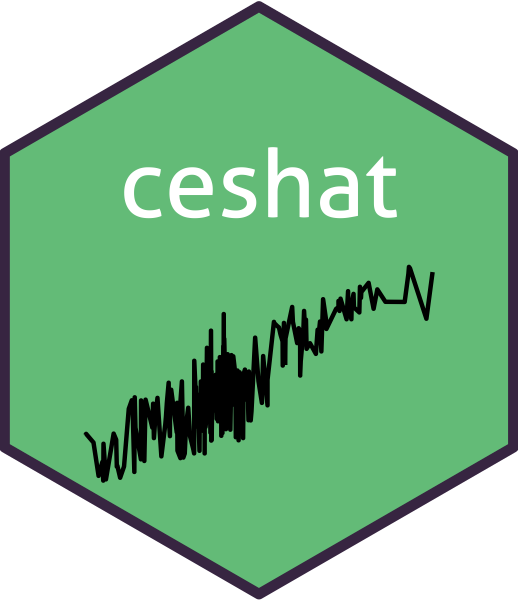

```{r setup, include=FALSE}
knitr::opts_chunk$set(
  comment = "#>",
  collapse = TRUE,
  out.width = "70%",
  fig.align = "center",
  fig.width = 6,
  fig.asp = .618
  )
options(digits = 3)
pander::panderOptions("round", 3)
```

# ceshat <a href='https://github.com/ygeunkim/ceshat'></a>

<!-- [](https://travis-ci.org/ygeunkim/ceshat) -->
[](https://travis-ci.com/ygeunkim/ceshat)
[](https://codecov.io/gh/ygeunkim/ceshat?branch=master)

## Overview

This is an R package to help the [SKKU nonparametric statistics project](https://github.com/ygeunkim/nonparam-cvar). It is basically based on the paper

[Cai, Z., & Wang, X. (2008). *Nonparametric estimation of conditional VaR and expected shortfall*. Journal of Econometrics, 147(1), 120-130.](https://www.sciencedirect.com/science/article/abs/pii/S0304407608001292)

## Installation

```{r, eval=FALSE}
# install.packages("devtools")
devtools::install_github("ygeunkim/ceshat")
```

